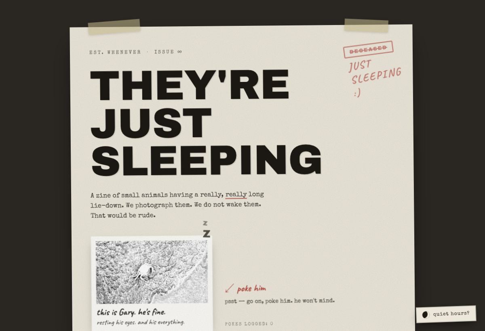
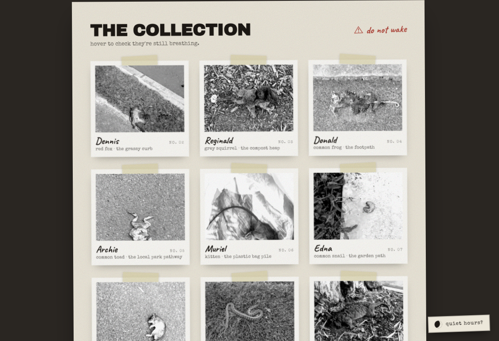
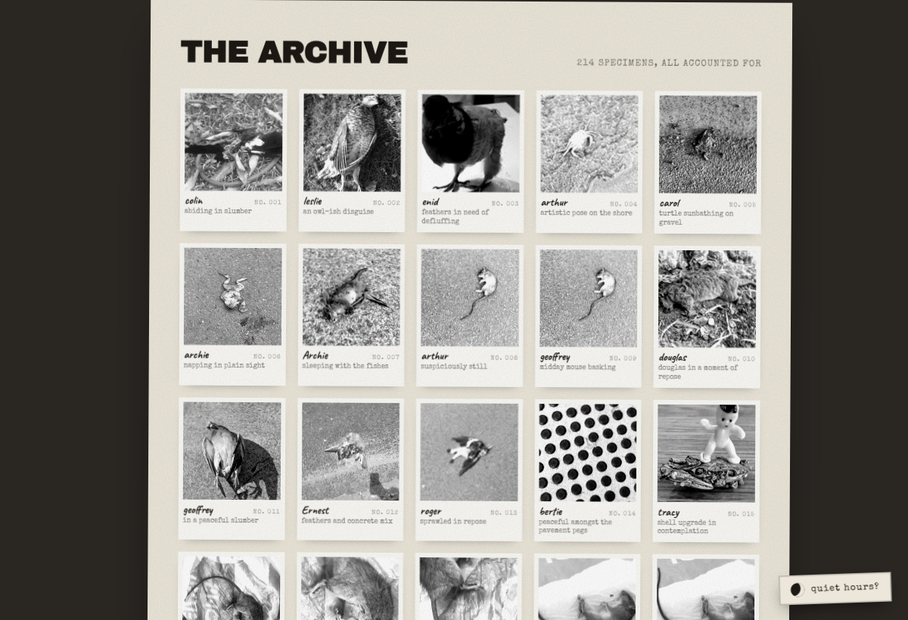
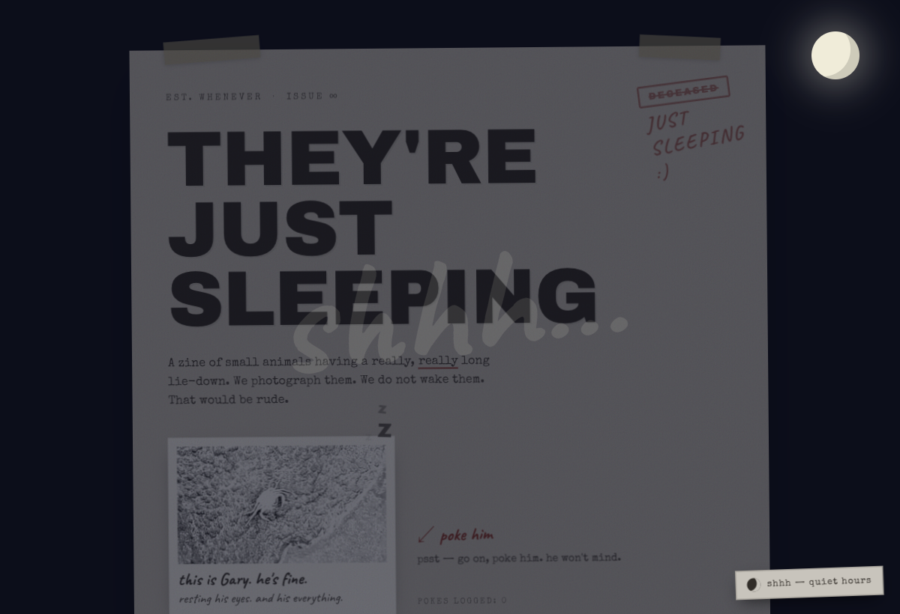
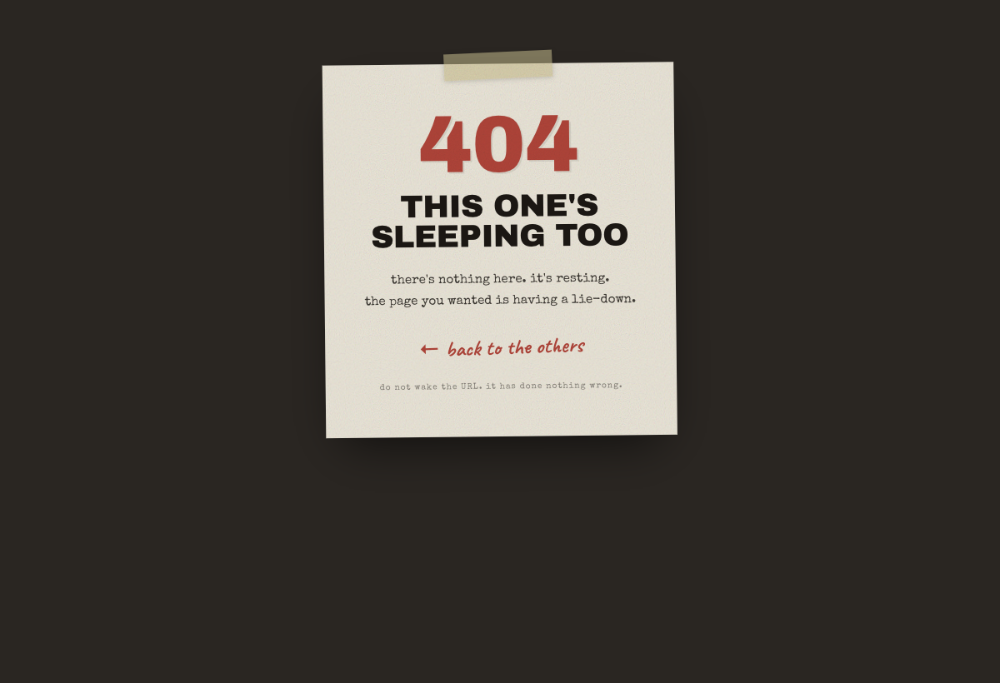

# They're Just Sleeping

> A zine of small animals having a really, *really* long lie-down. We photograph them. We do not wake them. That would be rude.

A single-page vintage photo-zine, live at **[theyrejustsleeping.com](https://theyrejustsleeping.com)**. Deadpan British humour over a paper-collage aesthetic — film grain, typewriter type, and 214 specimens who are definitely, certainly, just sleeping.



---

## What it is

A static site built from ~214 personal photos. It has three things going on beyond "gallery":

1. **The collection** — a curated set of named "specimens", each with a species, an invented mundane location, and a grumpy first-person line insisting they weren't asleep.
2. **The archive** — every photo, captioned, with the wake-line as a hover tooltip.
3. **A bit of life** — poke the crab (it does nothing, persistently), and a "quiet hours" night mode.

| The collection | The archive | Quiet hours | 404 |
|---|---|---|---|
|  |  |  |  |

## How it's built

The interesting parts:

**Hosting — Cloudflare Workers static assets, no Worker script.** It's a pure static build deployed as assets-only (`wrangler.jsonc` has no `main`). Static-asset requests don't invoke Worker code, so the site is effectively free and unmetered. Hashed assets are served `immutable` via a `_headers` file; the apex is a Workers custom domain.

**Images — build-time, not runtime.** ~214 source photos (originally 968 MB) are pre-shrunk to ~2000px (`scripts/shrink.ts`), then [`astro:assets`](https://docs.astro.build/en/guides/images/) generates responsive AVIF/WebP variants at build with Sharp — ~700 optimized files, no Cloudflare Images, no per-request cost. Astro's image cache (`node_modules/.astro`) keeps rebuilds fast.

**Content — AI-generated, then curated.** The zine copy (species, names, locations, wake-lines, captions) is generated per-photo by a vision model (Moonshot `moonshot-v1-8k-vision-preview`) in `scripts/caption.ts` → `scripts/captions.json`. `scripts/pick-featured.ts` then selects a diverse, recognisable set for the collection and regenerates the typed `specimens.ts`. Both scripts are re-runnable.

**CSS — no framework.** Two-tier design tokens (fixed primitives → semantic aliases) in `tokens.css`; everything shared (reset, fonts, the six keyframes, the grain texture) lives in one global stylesheet under `@layer`; each component owns a scoped `<style>` that only references semantic tokens. Night mode is a `data-theme` attribute re-mapping the semantic tier — no JS re-render. Hover-to-wake is pure CSS.

**Interactions — minimal JS.** Only the poke counter and the night-mode toggle ship JavaScript (a few lines each, persisted to `localStorage`). Everything else is CSS.

## Stack

- **[Astro](https://astro.build)** (static output, no adapter) · **TypeScript** (`astro/tsconfigs/strict`)
- **[Biome](https://biomejs.dev)** (lint + format) · **pnpm**
- **Sharp** / `astro:assets` for build-time image optimization
- **Cloudflare Workers static assets** + **Wrangler** for hosting
- No CSS framework — scoped styles + CSS custom properties

## Run it locally

```bash
pnpm install
pnpm dev        # http://localhost:4321
pnpm build      # astro check + static build to dist/
pnpm preview    # serve the built site
```

The repo ships with the pre-shrunk photos and generated captions, so it builds out of the box. To regenerate content you'll need a `MOONSHOT_API_KEY` in your env:

```bash
node scripts/shrink.ts          # re-shrink originals → src/photos/archive
node scripts/caption.ts         # caption every archive photo → captions.json
node scripts/pick-featured.ts   # pick featured specimens → specimens.ts + featured/
```

## Deploy

```bash
pnpm build
pnpm exec wrangler deploy       # assets-only deploy to Cloudflare
```

## Project structure

```
src/
  layouts/Layout.astro       # imports global.css; <head>; data-theme
  pages/index.astro          # composes the sections
  pages/404.astro            # on-brand 404
  components/                # Hero, Faq, SpecimenCard, FeaturedGrid, ArchiveGrid, Footer, NightToggle
  data/specimens.ts          # featured card data (generated)
  styles/{tokens,global}.css # two-tier tokens + reset/fonts/keyframes/grain
  photos/{featured,archive}/ # pre-shrunk sources
scripts/                     # shrink.ts, caption.ts, pick-featured.ts (+ tests)
public/                      # _headers, robots.txt, favicon.svg, og.png
docs/                        # design spec, implementation plan, screenshots
```

## License

Code under the [MIT License](LICENSE). The photographs in `src/photos/` are © Jason Matthew, all rights reserved — please don't reuse them; they're included so the site builds.

---

<sub>no animals were disturbed in the making of this zine. several were gently photographed. all are fine.</sub>
